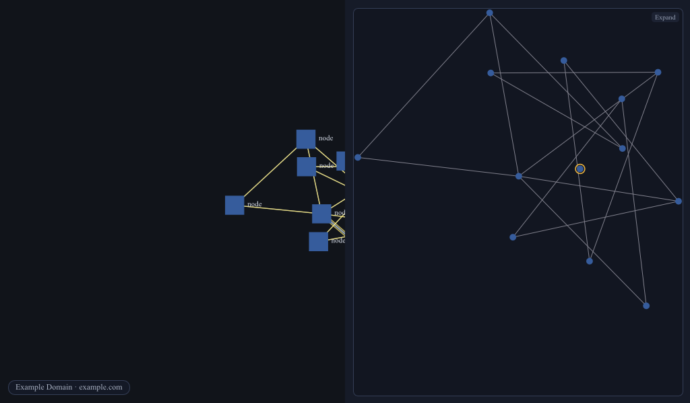
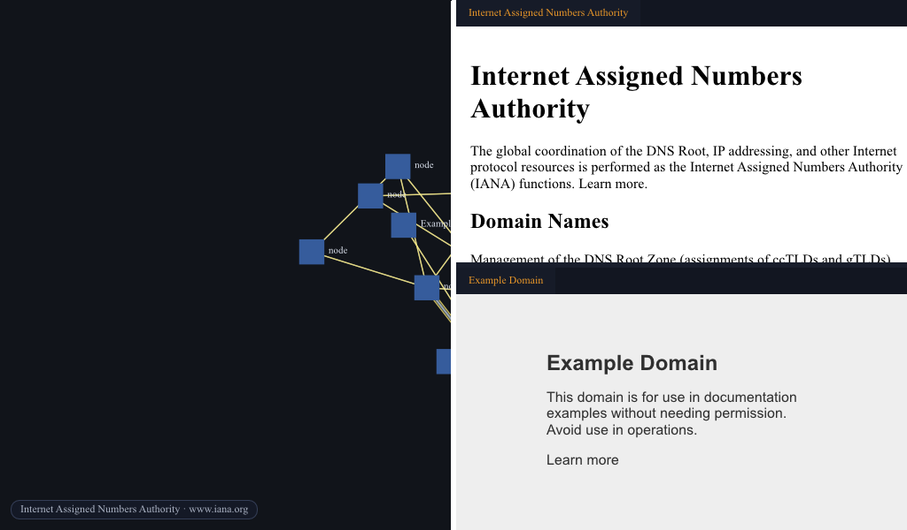

# turnstone

Turnstone is a graph-workspace browser: an infinite canvas of nodes, panes, and
web surfaces over a semantically related content graph. It is the reference
host for [mere](https://github.com/mark-ik/mere), the library that composes
the graph substrate (chartulary, stemma, scholia), persistence (muniment,
codicil), retrieval and inference (sibylla, vates), and identity (personae)
into one lake of content.

The name is the English calque of *meerkat*: Dutch *meer* + *kat*, lake-cat.
Mere is the lake; turnstone is the animal you meet at it.

## Build and run

```sh
cargo run     # the turnstone window
cargo test    # unit tests
```

Turnstone pulls `mere` and the genet engine family as git dependencies; a plain
`cargo build` fetches them. Headed self-drive receipts live under `scenarios/`.

## Status

Working reference host. Turnstone obviated mere's former `meerkat` crate on
2026-07-18: the behavioral deletion matrix went green and meerkat left mere's
tree, so the browser host now lives here as its own binary over the `mere`
library.

What runs today: the graph canvas (pan / zoom / isometric, deterministic
layout strategies); a summonable omnibar (find / go / actions lanes);
back, forward, reload; live web content on two engine lanes (the genet stylo
lane and the clean-room `genet.livery` lane) with a per-node viewer override;
retargeting panes (Roster, Trail, Gloss, Inspector, Apparatus) and a
platen-tiled Workbench; multi-window lenses with identity-preserving pane and
tile tear-out; and multi-session (`sessions/<id>/` with a switcher and
restart restore). Every capability carries a self-driving scenario receipt
(the shared genet-probe driver) plus an accessibility projection.

The live plan is `design_docs/2026-07-10_turnstone_architecture_plan.md`; the
founding brief is `design_docs/2026-07-08_turnstone_founding.md`.

## Screenshots

<p align="center">
  <br>
  <sub>Gloss keeps the graph's wider shape visible while the canvas stays focused on the current node.</sub>
</p>

<p align="center">
  <br>
  <sub>The Workbench tiles graph nodes into live document surfaces beside the canvas.</sub>
</p>

## Graphshell endpoint

Turnstone exposes its first local Graphshell projection through the library's
`remote_projection` adapter. Mere cartography maps the live graph into a
Scenograph spiral and routed relations; Graphshell resolves separately
transferred cards and returns advertised intents through Servitor. The G3
receipt and exact acceptance boundary are recorded in
`docs/2026-07-22_g3_graphshell_endpoint_receipt.md`.

## License

MIT OR Apache-2.0.
